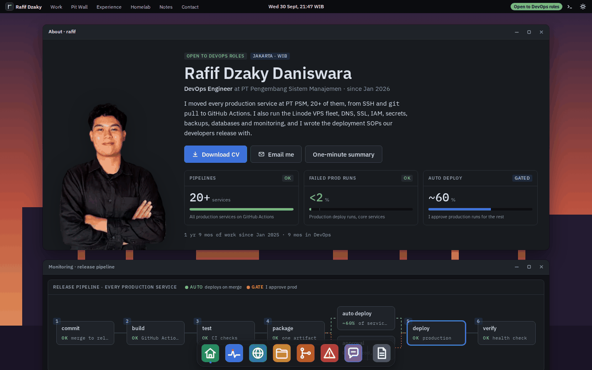

# rafif-portfolio

Personal engineering portfolio for Rafif Dzaky Daniswara, live at
[rafifdzaky.com](https://rafifdzaky.com). Static site built with Astro, styled
as PitOS, the desktop from [Pit Wall On-Call](https://github.com/rafifdzaky27/pit-wall-on-call).



```bash
npm install
npm run dev          # http://localhost:4321
npm run build        # outputs dist/, then adds the CSP hashes
npm run check        # astro check (types)
npm run check:links  # build + verify every internal link and anchor
```

## Where things live

| Path | What |
|---|---|
| `src/data/profile.ts` | Contact, experience, skills, education, credentials |
| `src/data/pitwall.ts` | Pit Wall On-Call screenshots, dark and light |
| `src/data/homelab.ts` | Homelab items, troubleshooting notes, 31-module roadmap with statuses |
| `src/data/ops.ts` | Postmortems, architecture decisions, first-90-days plan |
| `src/content/work/*.mdx` | Case studies (CI/CD, monitoring, Linux ops, Pit Wall On-Call) |
| `src/components/os/` | PitOS shell: window, dock, wallpapers, icon sprite |
| `src/components/diagrams/` | Case-study diagrams |
| `src/styles/tokens.css` | Colour, type, spacing and motion tokens, dark and light |
| `src/styles/pitos.css` | Shared PitOS parts: windows, panels, service maps, file lists |
| `public/Rafif_Dzaky_Daniswara_Resume.pdf` | Résumé served for View / Download |
| `pipeline-templates/` | v2 Laravel CI/CD templates (draft; not part of the site build) |
| `docs/design-rationale.md` | Design decisions |

## Deploy

A merge to `main` runs `.github/workflows/deploy.yml`. It builds the site,
checks links, runs a mobile Lighthouse budget (`scripts/lighthouse.mjs`),
copies the release to the homelab over Tailscale, and verifies the origin,
the public site and the security headers. `.github/workflows/status.yml`
checks the public site and feeds `/status`.

### Status checks every 15 minutes

GitHub runs scheduled workflows late on quiet repositories, often hours apart.
An external scheduler starts the check on time instead, and the cron stays as a
fallback.

1. Create a fine-grained GitHub token for this repository only, with
   **Actions: Read and write**.
2. On [cron-job.org](https://cron-job.org), add a job that runs every 15 minutes:
   - URL: `https://api.github.com/repos/rafifdzaky27/portfolio/actions/workflows/status.yml/dispatches`
   - Method: `POST`
   - Headers: `Authorization: Bearer <token>`, `Accept: application/vnd.github+json`
   - Body: `{"ref":"main"}`
3. A good call returns `204`. The run shows up under Actions as `workflow_dispatch`.

## Updating

- **New résumé:** replace `public/Rafif_Dzaky_Daniswara_Resume.pdf` (keep the filename).
- **Homelab module done:** change its `state` in `src/data/homelab.ts`. Do it only once there's a repo, screenshot or log to back it.
- **New case study:** add an `.mdx` file to `src/content/work/` with the same front matter as the others. `order` sets its place.
- **New Pit Wall screenshots:** replace the files in `src/assets/pitwall/`. Keep a dark and a light version.
